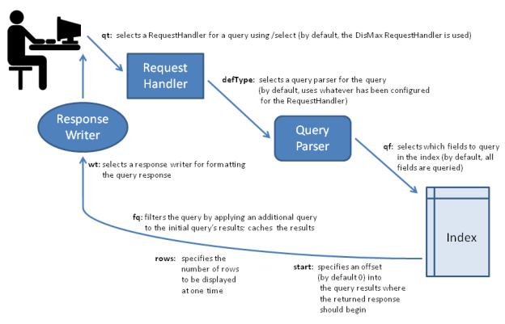

# **Solr基础**

## 1. Overview

Solr是一个搜索服务引擎，用于快速地查询检索数据。
Solr基于Apache Lucene建立；Lucene是一个基于java的开源信息检索库。
Solr的主要特点是：全文搜索、高亮、分面搜索(faceted search)、实时检索、动态聚簇、数据库集成等。

Solr请求是简单的HTTP请求，返回结构化文档作为响应，例如Json、XML、CSV或其他形式。当数据量和请求数量很大时，可以使用SolrCloud进行分布式处理。

Solr对索引进行搜索，而不是搜索文本，从而实现快速响应。为了搜索文档，Solr依次进行如下操作：

1. 索引(Indexing): 首先将数据转化为索引.
2. 查询(Querying): 处理用户的查询请求.
3. 映射(Mapping): 将请求映射为数据库中的文档.
4. 排名(Ranking): 根据相关性将结果排序.

## 2. 基本概念

Solr的基本数据单元是**文档(Documents)**, 文档由**字段(Fields)**组成。字段可以有多种数据类型，可以指明数据类型(field type)，使得Solr能够正确解释和查询字段数据。

添加一个document时，Solr从field提取信息加入到索引中。在查询时，Solr检索索引并返回相应document。

**字段分析(Field Analysis)**：决定了Solr如何处理数据、建立索引。例如如何分词、大小写等。

**Solr模式文件**：保存Solr字段、字段类型的信息。其名称和位置随Solr的设置而定。

## 3. Analyzers, Tokenizers, and Filters

- **分析器（Field analyzers）**：在索引和查询时使用。分析器接收字段的文本，生成符号(token)流。分析器可以是一个类，也可由一系列tokenizer和filter类组成。

- **分词器（Tokenizers）**：将字段数据拆分成词法单元-符号(tokens)。

- **过滤器（Filters）**：接受一串符号，进行丢弃、保留或创建新符号的处理。

## 4. 索引和基本数据操作

Solr 索引可以接受来自许多不同来源的数据，包括 XML 文件、逗号分隔值（CSV）文件、从数据库表格中提取的数据以及常用文件格式（如 Microsoft Word 或 PDF）中的文件。

将数据加载到 Solr 索引中的三种最常见的方法：1) Solr Cell 框架来获取二进制文件或结构化文件. 2) 发送HTTP请求到Solr服务器. 3) 编写自定义Java应用程序以通过Solr的Java Client API获取数据。

**Data Import Handler, DIH**：
Data Import Handler (DIH)从结构化数据存储（例如关系型数据库）中导入数据并建立索引。

更新文档：建立索引之后，Solr有三种方式更新文档的部分更改：1）atomic update：更新一个或几个字段，无需重新索引；2）in-place update：used for updating single valued non-indexed and non-stored docValue-based numeric fields. 3）optimistic concurrency/optimistic locking: allows conditional updating a document based on its version.

## 5. 搜索

Solr搜索请求由 **请求处理器(request handler)** 处理。Solr支持多种请求处理器，有些用来处理搜索查询，有些用来控制复制索引等任务。

为了处理搜索查询，请求处理器调用 **查询解析器(query parser)**，解释查询语句。不同的查询解析器支持不同的语法。Solr 默认的查询解析器被称为标准查询解析器(Standard Query Parser)，或者更常见说法是 “lucene” 查询解析器，能进行精确的搜索。Solr 还包括 DisMax 查询解析器和扩展的 DisMax（eDisMax）查询解析器，能够更多容忍语法错误。

搜索参数可以指定一个 **filter query**。作为搜索响应的一部分，过滤查询针对整个索引运行查询并缓存结果。搜索查询可以请求在搜索响应中突出显示某些词语。搜索响应也可以配置为包含片段（snippets，文档摘录），如谷歌等流行的搜索引擎，提供3-4行文本作为搜索结果的描述。

**响应书写器（response writer）** 组件管理查询响应的最终呈现。Solr 包含各种响应编写器，包括 XML 响应编写器和 JSON 响应编写器。

下图总结了搜索过程的关键要素。

### ref:

https://en.wikipedia.org/wiki/Apache_Solr

http://lucene.apache.org/solr/guide/7_1/

https://www.w3cschool.cn/solr_doc/

  
