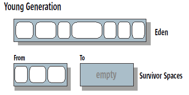

## summary: Memory Management in the Java HotSpot™ Virtual Machine
## 2. J2SE 5.0 HotSpot JVM 的垃圾回收器

J2SE 5.0 update 6 包括四个垃圾回收器，它们都是分代的。

####HotSpot分代

HotSpot虚拟机的存储分为三个代：一个年轻代、一个老年代和一个持久代。大多数对象分配在年轻代。老年代包括从年轻代存活过一定回收次数的对象，和少数直接分配在老年代的较大的对象。持久代存储便于垃圾回收器管理的对象，如描述类和方法的对象、以及类和方法本身。

如图，年轻代由一个称为Eden的区域和两个生存区组成。大多数对象（除了分配在老年代的）都分配在Eden。生存区存放至少活过一轮收集的对象。任一时刻两个是生存区有一个存放这些对象，另一个直到下次收集前都是空的。

关于分配，当存在较大的连续内存区时，只需记录空闲区开始位置，通过更新指针的方法就可实现快速分配（当有足够空间时）。而对于多线程的应用，需要保证线程安全性。如果使用一个全局的锁，则分配操作会成为性能瓶颈。HotSpot JVM使用Thread-Local Allocation Buffers (TLABs)，即给每个线程独立的buffer用于分配。

####垃圾回收过程

当年轻代被填满时，仅对这一代进行年轻代收集（也称为次要收集）。

当年老代或持久代被填满，进行整体收集（也称主要收集）：所有代都进行收集。通常年轻代先进行收集（使用年轻代的垃圾回收算法），然后老年代和持久代进行老年代的垃圾回收算法。如果发生紧凑，则各代分别进行。

有时年老年代太满，无法容纳年轻代要提升的对象。这种情况下，除了CMS回收器之外，在整个堆上进行老年代垃圾回收算法。

###1. Serial Collector 串行回收器

在串行回收器中，年轻代与老年代的回收都是串行地进行，使用单个CPU，当垃圾回收进行时应用程序完全停止。

#### 串行回收器的年轻代回收

参照上图，年轻代回收中，Eden中的的存活对象拷贝到To区；存活区（From区）中的较年轻的存活的对象也拷贝到To区；From区中较老的存活对象拷贝到老年代。如果To区被装满，无法容纳所有需要被拷贝的存活对象，那么这些对象无论存活了多久都拷贝到老年代。年轻代收集完成后原来的Eden区和From区都变成空闲的（只有死对象未被拷贝），之后交换From区和To区的角色。

#### 串行回收器的老年代回收

串行回收器的老年代采用mark-sweep-compact回收算法。在mark阶段，回收器鉴别存活对象；sweep阶段鉴别垃圾。接着回收器进行sliding compaction（滑向一侧的紧凑），将所有存活的对象向老年代空间的开始方向移动。于是回收结束后另一侧就是连续的空闲空间。对持久代的处理相同。

#### 使用串行回收器

使用于客户端类程序、不要求极短的停止时间的场合。J2SE 5.0 release中串行回收器是非服务器类机器的默认选择；或可使用命令行选项-XX:+UseSerialGC明确地选择串行回收器。

###2. Parallel Collector 并行回收器

并行回收器（parallel collector/throughput collector）使用多个CPU进行垃圾回收。

#### 并行回收器的年轻代回收

并行回收器使用的年轻代回收方法是串行回收器的并行版本，它仍旧是top-the-world式的。因为使用了多个CPU，降低了消耗，增加了吞吐率。

#### 并行回收器的老年代回收

并行回收器的老年代回收与并行回收器采用相同的串行的mark-sweep-compact方法。

#### 使用并行回收器

并行回收器适用于运行在多核机器上、并且不对停止时间作要求的的应用（因为对老年代的回收仍可能花费较长时间），例如批处理、科学计算任务等。

J2SE 5.0 release中，并行回收器是服务器类机器的默认选择；或可使用命令行选项-XX:+UseParallelGC显式地选择并行回收器。

###3. Parallel Compacting Collector 并行紧凑的回收器

并行紧凑回收器在J2SE 5.0 update 6中引入，其与并行回收器的区别在于对老年代的收集使用了不同的算法。并行紧凑回收器最终会取代并行回收器。

#### 并行紧凑回收器的年轻代回收

并行紧凑回收器的年轻代回收方法与并行回收器相同。

#### 并行紧凑回收器的老年代回收

并行紧凑回收器的老年代与持久代的回收采用侧滑紧凑方法，并且大部分工作是并行进行的。

#### 使用并行回收器

并行回收器适用于运行在多核机器上、并且不对停止时间作要求的的应用（因为对老年代的回收仍可能花费较长时间），例如批处理、科学计算任务等。

J2SE 5.0 release中，并行回收器是服务器类机器的默认选择；或可使用命令行选项-XX:+UseParallelGC显式地选择并行回收器。

   
