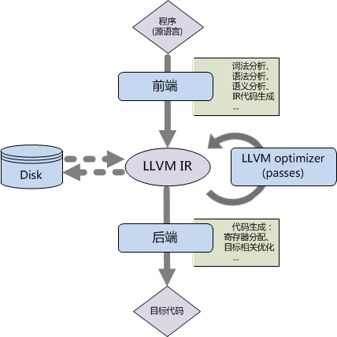

# LLVM笔记1：初识LLVM

由于项目需要，还是没逃开要摆弄Clang+LLVM ☹，不过这也是个好事，毕竟如果自称“懂编译器但是不了解llvm”多少说不过去。由于这是个历史悠久的大型项目，因此尽量系统学习并记录下来。

根据官网的介绍，LLVM是一个模块化、可复用的编译器工具链集合，与虚拟机（virtual machine）没有什么关联，LLVM四个字母即作为该系统的全称。LLVM最早是UIUC的一项研究型项目，了解了一下发起人之一 Chris Lattner 的经历，实在是十分厉害（而且是大学霸）。

LLVM的目标是能够为任意编程语言提供编译支持。LLVM采用了前后端分离的设计，分为 LLVM core 和 Clang 两个项目：

- LLVM：围绕LLVM中间表示（IR）的一系列优化和代码生成的库，是独立于源语言和目标语言的。在LLVM的基础上能够容易地自己设计编程语言。

- Clang：LLVM系统的第一个前端，面向C和C++语言，其目标是能进行非常快速的编译、并且提供十分友好的报错和warning信息。（clang中的clang-check工具能够进行语法检查，也许可以看看是怎么做的，例如错误拼写的纠正。）

此外基于LLVM的项目还有 LLDB（调试器）、libc++ 等等。

Clang和LLVM的安装可以按照 clang.llvm.org 中的步骤，从源码build。

## 1. 基本结构

LLVM基本结构还是典型的“前端-中间表示-后端”的形式。



## 2. LLVM的核心库

为了解耦和，在设计上LLVM将组件间的交互限制在较高的抽象层次。LLVM组件是C++编写的库，采用面向对象模式。LLVM和Clang的核心库如下：

<table border="2" align="left">
  <tr>
    <th>libLLVMCore</th>
    <td>LLVM IR相关逻辑。包括IR构造和校验、pass manager.</td>
  </tr>
  <tr>
    <th>libLLVMAnalysis</th>
    <td>several IR analysis passes</td>
  </tr>
  <tr>
    <th>libLLVMTarget</th>
    <td>generic target abstractions</td>
  </tr>
  <tr>
    <th>libLLVMX86CodeGen</th>
    <td>x86 backend (代码生成, 变换, analysis passes)。<br/>
    每种目标机器都有相应的库，例如 LLVMARMCodeGen 和 LLVMMipsCodeGen 分别实现 ARM 和 MIPS
后端，等等。
    </td>
  </tr>
  <tr>
    <th>libLLVMSupport</th>
    <td>general utilities:
      <ul> 
      <li> error </li>
      <li> integer and floating point handling </li>
      <li> command-line parsing </li>
      <li> debugging </li>
      <li> etc. </li>
      </ul> 
    </td>
  </tr>
  <tr>
    <th>libclang</th>
    <td>implements a C interface</td>
  </tr>
  <tr>
    <th>libclangDriver</th>
    <td>分析命令行参数并组相应的织编译过程</td>
  </tr>
  <tr>
    <th>libclangAnalysis</th>
    <td>a set of frontend level analyses provided by
Clang:<br/>
        CFG and call-graph construction, reachable code, format string security, etc.
    </td>
  </tr>
</table>

## 3. LLVM 中的 C++

LLVM 的实现中利用了 C++ 的一些语言性质。

#### 3.1. 多态

通过继承和多态，将基本实现放在基类进行复用，不同的后端实现具体的目标相关的操作覆盖相应的方法。例如MIPS目标机器对应的类继承 了 LLVMTargetMachine：

```c++
class MipsTargetMachine : public LLVMTargetMachine {
  MipsSubtarget Subtarget;
  const DataLayout DL;
...
```

#### 3.2. 模版

模版(templates)在LLVM代码中很常见，用来生成一系列相似的通用的功能。下面的例子使用模版生成函数：检查整数是否是N bit数字。

```c++
llvm/include/llvm/Support/MathExtras.h:

template<unsigned N>
inline bool isInt(int64_t x) {
  return N >= 64 ||
    (-(INT64_C(1)<<(N-1)) <= x && x < (INT64_C(1)<<(N-1)));
}
```

使用模版较多容易导致编译时间增多，LLVM 特别地针对这个问题进行了优化。下面的片段实现了模版的特例，快速地实现常用的8 bit宽度检查。

```c++
template<>
inline bool isInt<8>(int64_t x) {
  return static_cast<int8_t>(x) == x;
}
```

#### 3.3. 字符串引用

对于字符串引用，何时应该使用char*、何时使用string类，是C++编程中经常被讨论的问题。LLVM需要管理大量字符串，为了提高效率引入了`StringRef`来引用字符串。下面是几种方式的比较：

<table border="2">
  <tr>
    <th>const char*</th>
    <td> 不能用于本身含有 null 字符的字符串
    （因为 null 字符是C风格字符串的终止符号）
    </td>
  </tr>
  <tr>
    <th>const std::string&</th>
    <td>由于string类要持有字符串buffer，因此传参易引起额外的内存分配和字符串拷贝。</td>
  </tr>
  <tr>
    <th>StringRef</th>
    <td>可以和`const char*`一样传值传参；同时维护字符串大小信息，因此可以包含null字符。</td>
  </tr>
</table>


由于C++11之前拷贝字符串代价较高，LLVM还引入了 `Twine` 类用来处理字符串连结操作：
仅保存子串的引用，不进行实际的字符串连结。

#### 3.4. 其他LLVM编程惯例

- 尽可能多地使用 **断言(assertion)**。类似编译器这样的复杂软件系统，定位bug可能会十分困难，因此尽可能早地检测问题（或确保行为的正确性）对于节省时间十分有效。`libLLVMSupport`库提供了assertion机制。

- 使用 **smart pointers** ，自动地进行内存空间释放。

其他LLVM编程惯例可参考 http://llvm.org/docs/CodingStandards.html
，对于C++编程很有参考价值。

## 4. 可插拔的 Pass 接口

LLVM 的 **pass** 指一个优化或分析过程。
通过 LLVM API 可以在编译过程中注册 pass。
Pass manager 负责注册、调度 pass 或声明 pass 之间的依赖关系。


## ref

LLVM官网
- http://llvm.org/

GCC，LLVM，Clang对比
- https://www.cnblogs.com/qoakzmxncb/archive/2013/04/18/3029105.html

参考书：《Getting Started with LLVM Core Libraries》

<br/><br/>
