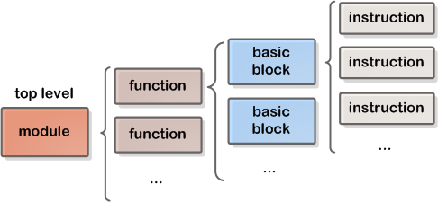

# LLVM 笔记3：LLVM 中间表示

编译器的 IR 设计理念：

- high-level IR： 容易优化

- low-level IR： 容易生成目标相关代码、针对特定的目标机器进行优化；一般性较差，不利于对多个不同架构生成目标代码。

GCC 和 LLVM 这样支持多种平台的编译器称为 *retargetable compilers* ，需要具有通用性的 IR 以控制开发成本。在通用性 IR 上可以进行目标无关优化。另一方面，一个好的 retargetable compiler 为了实现目标相关的优化，还应该同时采用其他的 lower level IR。

LLVM IR 指 LLVM 中最具有一般性的中间表示，使用 `Function` 和 `Instruction` 等类表示。除此以外 LLVM 还使用了其他层次的 IR，但官方上，LLVM IR 仅指 `Instruction` 类等。LLVM IR 有三种等价形式：内存表示，bitcode file，LLVM assembly file。

编译为LLVM字节码：

    $ clang sum.c -emit-llvm -c -o sum.bc

生成 assembly file：

    $ clang sum.c -emit-llvm -S -c -o sum.ll

下图展示了 LLVM IR 的基本模型。模块（module）是最顶层结构，由若干 function 组成，此外还包含 global variables, the target data layout, and external
function prototypes as well as data structure declarations. LLVM local value 相当于寄存器。



LLVM 语法的一些基本性质：

- 采用单静态赋值形式 （Static Single Assignment, SSA），易于分析和优化。

- 指令为三地址码
（two source operands and a destination operand）

- 寄存器的个数没有上限。
LLVM local value 的命名以 `%` 开头。

## IR 层优化

程序被翻译为LLVM IR之后，会经过一系列目标无关优化。

`opt`工具可以对 bytecode file 进行优化，并且与 Clang 一样接受 `-O0, -O1, -O2, -O3, -Os` 和 `-Oz` 参数。此外 Clang 还支持 `-O4`。每个 flag 表示一种优化流程（/等级）:

- `-O0`：no optimization

- `-O1`：between `-O0` and `-O2`

- `-O2`：enables most optimizations

- `-Os`：considered as `-O2` with extra optimizations to reduce code size

- `-Oz`：like `-Os` (and thus `-O2`), but
reduces code size further

- `-O3`：在`-O2`的基础上进行一些可能耗时长或增加代码大小的优化，以求更高的程序运行速度

- `-O4`：enables link-time optimization (On supported platforms). object files are stored as LLVM bitcode file.

使用 opt 工具对 bytecode file 进行优化：

    $ opt -O3 sum.bc -o sum-O3.bc -stats

`-stats`参数表示打印每个pass的统计信息，`-time-passes`参数显示每个优化过程所耗时间，等等。

## Pass API

通过实现 `Pass` 类的子类可以实现具体的优化过程。
`Pass` 类的不同子类具有不同的优化粒度：

- `ModulePass`：allows an entire module to
be analyzed at once, without any specific function order。要实现该类，需要重载`runOnModule()`方法。

- `FunctionPass`：handle one function at a
time, without any particular order。要实现该类，需要重载`runOnFunction()`方法。

- `BasicBlockPass`: basic block 粒度的优化. 要实现该类，需要重载`runOnBasicBlock()`方法。

## 实现一个定制化的 Pass

基本步骤：

1. 根据需要优化的粒度，选择的 `Pass` 的子类进行实现，重载相应的方法。

    在 lib/Transforms 目录下建立 pass 代码目录，实现具体的 pass 逻辑。LLVM 项目中提供了示例的 "Hello World" pass, 位于 lib/Transforms/Hello 目录（下面一些代码以此为例）。

2. 注册 Pass

  ```c++    
  static RegisterPass<FnArgCnt> X("hello",
      "inserting Hello World Pass");
  ```

3. 将 Pass 代码与 LLVM 一起 build：

  - 在代码目录建立 Makefile 文件。
  - 修改 lib/Transforms/Makefile 文件的 PARALLEL_DIRS 变量


#### Build pass with Cmake：

下面的移植过程在 llvm 4.0 版本能够成功。

- 在代码目录建立 CmakeLists.txt 文件。示例：

  ```
  add_llvm_library( LLVMHello
    Hello.cpp

    ADDITIONAL_HEADER_DIRS
    ${LLVM_MAIN_INCLUDE_DIR}/llvm/Transforms

    DEPENDS
    intrinsics_gen
    )
  ```

  代码目录 LLVMBuild.txt 示例：

  ```
  [component_0]
  type = Library
  name = Hello
  parent = Transforms
  Library_name = Hello
  ```

- 上层 Transforms 目录 CmakeLists.txt 文件，添加：

  ```
  add_subdirectory(Hello)
  ```

  LLVMBuild.txt `common` 下的 `subdirectories`添加：`Hello`.

- 为了在 Clang 中通过命令行参数使用 pass，在 lib/Transforms/IPO/PassManagerBuilder.cpp 添加：

  ```c++
   static cl::opt<bool> Hello("hello", cl::int(false),
      cl::desc("Enable Hello World pass"),
  ```

  在函数 `void PassManagerBuilder::populateModulePassManager` 中添加：
  ```c++
  ...
  // Allow forcing function attributes as a debugging and tuning aid.
  MPM.add(createForceFunctionAttrsLegacyPass());

  //添加的代码
  MPM.add(createHello(Hello));
  ...
  ```

  以上需要引用相应的头文件例如 Hello.h，可以在 include/llvm/Transforms/ 目录下建立头文件。`createHello`的实现示例：

  ```c++
  Pass *llvm::createHello(bool flag){return new Hello(flag);}
  ```

  lib/Transforms/IPO/LLVMBuild.txt `required_libraries` 添加 Hello（否则 make 时会出错，找不到函数实现）。

完成上面步骤后再使用 `-mllvm -hello` 参数运行 Clang 编译程序，可以驱动 Hello pass。

#### 添加 annotate

为了编程时控制在哪些函数上使用 pass、在哪些函数上禁止使用 pass，
可以在函数定义通过 annotation 声明。Clang 能够解析 annotation，不需要再修改前端代码。在 pass 实现中可以获取 annotation 内容并判断是否要进行处理。

具体实现可参考 ollvm 的 Utils.cpp 中 readAnnotate 函数。

## ref:

参考书：《Getting Started with LLVM Core Libraries》

http://llvm.org/docs/WritingAnLLVMPass.html

https://llvm.org/docs/CommandLine.html

<br/><br/>
